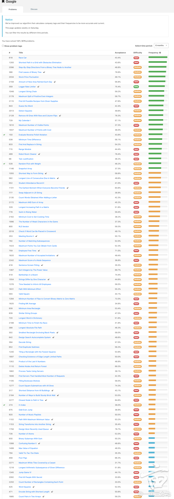

## 刷题总结

**拿到题目后需要问的问题**
- input/output type
- input size 以及 edge cases of null or empty
- input element 有无重复
- input element 的范围
  - 数字的话：全是正数或者全是负数？或者返回必须正数或负数？
  - string 的话：是不是都是 English letters(A-Z)？有没有特殊符号？有的话会有哪些会出现？
- 能不能改 input(1D/2D array 比较常见）
- 时间空间复杂度要求
  - 需不需要 in place
- 特殊情况的处理，没找到的时候返回什么？

**brute force 是 O(N) 时间复杂度的优化只能是 LOG(N)**
- 一般是 binary search
  - 对于 Java 或者 C，注意 start+end 可能会 overflow。需要用 start + (end - start) // 2
  - 一般是 mid 和 target 比较或者和 mid+-1 比较或者与 start / end 比较
  - 避免死循环用 (start + 1) < end
- 类似于 binary search 的剪枝
- exponential backoff

**tree 的题可以考虑**
- BSF/DFS
- DFS: pre-order, in-order, post-order
- BFS: level order traverse
- divide & conquer（无脑看左右子树然后再考虑最后的结果）
  - top down - recursive
  - bottom up - iterative
- 给 node 编号第 N 层可以 2^(n-1) 个 node
- 空间优化（知道就行）：Morris traversal:iterative approach to leverage preorder traversal that the the entire left subtree would be placed between the node and its right subtree.

**BST 考虑利用**
- inorder traverse 是个 sorted array
- 左子树 < ROOT < 右子树（某些可能有等于）向下 DFS 的时候记得更新 MIN 和 MAX

**BFS/DFS traverse**
- 求最短或者最少 XX 一般是用 BFS 比如最短路径
  - use BFS for unweighted graphs and use Dijkstra's algorithm for weighted graphs.
  - dijkstra 和普通图的不同之处在于每个 edge 有 weight 可以用min/maxheap 来找下一个 node
  - An implied condition to apply the Dijkstra's algorithm is that the weights of the graph must be positive. 如果 negative 需要用另一个算法不需要掌握
- 需要记住哪些已经 visited 过了
  - 用set, boolean,list, map
  - 用特殊符号，比如 *
  - 用特殊正数、负数，或者（-num）或者 0
- Backtracking with DFS
  - 进入下一层之前，update/addpath/dict 或者 Mark visited，下一层返回之后，需要 backtrack 之前的 update 或者用 remove 或者 unmark visited
- DFS traverse 的时候来计算结果，如果出现重复计算某一个，可以加入 memoization 来加速
- 如果深度太长，不推荐用 DFS recursive approach，因为会 stackoverflow
- Traverse 不只可以从 source 出发，也可以从 destination 反向出发找 source，reverse DFS/BFS 以及 bidirectional BFS

**array**
- prefix sum 很多时候都会用到，以及 prefix sum - target 有无出现和出现的次数
- 类似于 prefix sum 的还有 prefix product，但是计算 product 时需要注意有 0
- 注意 subsequence 和 subarray 的相同和区别之处
  - 相同：不能改变 element order 所以都不能 sort
  - 不同：subsequence 可以不连续，subarray 必须是连续的一段
- 去重
  - 一般是用 set 或者 map
  - 或者 sort，然后看前后是不是一样，一样的话就 skip
  - min/max 记得考虑 local min/max 和 global min/max 以及与当前 num 的比较
    - 尤其是找相乘的 product 的时候，negative * negative = positive
  - 找 MIN 的时候，初始化成最大，一般是 float('inf') 或者 0(全是正数)
  - 找 MAX 的时候，初始化成最小，一般是 float('-inf') 或者 0(全是正数)
  - min/max 还可以用 heap
  - Sliding window can only be used when nums are all positive, if it exists negative number, DP is needed.
- intervals: sort by start or end，有无 overlap 看是否 current start > last end
- 如果找下一个小的或者大的，考虑能不能用 monostack
- 需要 O(1) delete 操作的时候，如果不需要保持原有的顺序，可以把最后一个 element copy 到要删除的地方，然后删掉最后一个 element

**stack & queue**
- stack: LIFO
- DFS iterative
- [inorder/pre order/post order traverse iterative](https://leetcode.com/problems/binary-tree-postorder-traversal/solutions/45740/Summary-of-preorder-inorder-postorder-four-traversal-ways-for-each/)
- queue: FIFO
  - BFS iterative, sometimes needs to keep track of the count as well.
- pop 前注意检查是不是空的

**heap(priority queue)**
- 找最大或者最小
- 找第 K 大或者第 K 小，或者前 K 大、小
- 用 tuple 时会先按照顺序比较，如果第一个元素相同，会比较第二个元素，如果第二个元素是特殊的 object 比如 linked list node
  - 可以在 node 里面加入比较 function
  - 可以在 tuple 中加入一个不重要的但是有顺序的数，比如 index 作为第二个数，这样能避免比较第三个 nodeo bject

**string**
- 大部分是 two pointer，部分是 DP 或者 DFS
- palindrome
  - 可以考虑 reverse string 来比较
  - 找 palindrome 可以 expand from center，或者 DP
- 用特殊符号的时候，不要用 -，以防是数字转换过来的，负数也带 -

**int**
- 注意越界问题
  - 可以用 long 或者 double
  - start + (end - start) / 2 而不是 (start + end) / 2.0
  - num1 / 2.0 + num2 / 2.0 而不是 (num1 + num2) / 2.0
  - 或者是用 % 来表示 results

**DP**
- 两个 strings 是要建立二维数组，然后用来减少重复计算
  - 一般用 length + 1 考虑前 i 个的结果
- 从 i 到 i + 1 的时候，状态转换要考虑清楚，主要看怎么可以利用之前计算的结果
- 有的时候可能 DP 不是最后的结果，还需要用 min/max/sum(dp)
- 空间优化一般是
  - 1D 的需要记住前面的几个结果
  - 2D 的需要记住前面的 ROW 的结果，也就是滚动数组

**linkedlist**
- 快慢指针同时挪，或者先挪一个指针
- 有必要的时候，可以 reverse linked list，比如 palindrome 可以考虑 reverse linked list 来比较
- head 可能变化的时候，创建一个 dummy，返回 dummy.next
- 快慢指针如果都从 head 开始，要注意下面的情况，可以考虑 fast 从 head.next 开始
  - 只有两个数的时候，会不会出现死循环
  - 偶数的时候，mid 需要找靠左边的那个还是靠右边的那个
- 需要同时 update prev and next 的时候，用 doubly linked list
  - 大部分也可以用 ordered dict 解决

**其他模板背诵（按可能的常见度排序）**
- quickselect、sort
  - 一般用于解决第 K 或者前 K 的问题
  - in place 的，不需要额外空间
  - 不稳定，average O(NLOGN)，最好 O(1)，最差 O(N^2)
- merge sort
  - divide & conquer: top down & bottom up
  - min/max heap
- topological sort/order
  - 一般用于解决有方向的图，non-directed graph 不能用，需要用下面的 union find 或者普通的 DFS/BFS
  - 有向图看有没有 cycle 可以用 A directed graph has a topological order if it is acylic.
- union find
  - 某些题可以用 DFS/BFS
  - DFS、BFS 可能会有找不到某些点，只能用 union find
- trie
- mono stack/queue
  - 单调递增栈可以找到元素向左遍历第一个比它小的元素: 递增栈是维护递增的顺序，当遇到小于栈顶元素的数就开始处理
  - 单调递减栈可以找到元素向左遍历第一个比它大的元素: 维护递减的顺序当遇到大于栈顶元素的数开始处理
- 时间线的题可以用 sweep line +1 -1，然后 sort by 时间去找答案
- Bit manipulation using n&1 and(n >>= 1) or bin(int)
- segment tree（最后没时间，我自己没看）
- binary index tree（最后没时间，我自己没看）

还有需要注意的是，和面试官聊天的时候，一定要主动地从题目出发去分析。比如需要解决前五分钟的 data，需要知道时间，那么知道时间有几种方式，一个是 get time，一个是 call 的时候给 timestamp。要在面试的过程中，自己主动给面试官选项，而不是直接问面试官该怎么办，怎么拿时间。

## 系统设计

第一步，开始刷题的时候，刷累了，没事就逛一逛地里，收藏别人的系统设计相关的帖子，以备后面阅读。

第二步，看一些系统设计基础相关的帖子和视频。这里推荐这个[视频](https://www.youtube.com/watch?v=UzLMhqg3_Wc)以及大家都知道的 https://githubcom/donnemartin/system-design-primer 通过视频可以大概了解，常用的系统设计的概念以及工具，github 的帖子辅助提供更多的细节知识。

第三步，进一步了解数据库，主要是 SQL 和 NOSQL 的区别，DB lock 等。我之前用过一点 SQL 和 DDB（虽然都不多），所以主要多看了 Cassandra 和 mongoDB，看的是在 Coursera 上 IBM 的公开课，还有很多和 DB 相关的课可以选的。我只听了前面 2 个星期的课，没有做 assignment 或者 project，比较省时间。需要快速面试的建议跳过这一步，基本上面试只需要知道大致特征以及怎么选。

SQL(ACID)
- Consistency
- Structured data(fixed schema)
- Transactions
- Joins

NoSQL(BASE):
- Highper formance
- Unstructure ddata(flexible schema)
- Availability
- Easy scalability

需要支持 transaction 和 join 的，需要用 SQL，需要 high TPS 以及灵活 schema 的用 NOSQL 等等。

第四步，进一步了解数据库以外的其他知识。主题基本上 2 里面的视频都提到了，还有一些其他常见的比如 push & pull、consistent hashing、event sourcing、paxos & raft、cache、Redis、eventually & strong consistency 等。准备的话主要是通过搜不同的主题，去看不同的人的视频和帖子，楼主没有 bookmark 所有的帖子，基本都是看到后即兴 youtube search，找 view 比较高的看一个。基本上大家的解释都差不太多，比如 paxos & raft 看的是 https://www.youtube.com/@ongardie

第五步，了解实际中各种知识、概念、工具怎么串起来使用，主要是通过 DDIA 和 Alex xu 的 system design interview（每一章会先看一遍，然后自己 design，最后再比较查缺补漏）。

第六步，看大神们的视频和设计图，主要是东欧大哥 https://www.youtube.com/c/SystemDesignInterview 和朋友推荐的 https://www.youtube.com/@ScottShiCS 以及之前收藏的地里的帖子。

第七步，mock interview，找个好朋友 mock interview。第一次问题比较多，朋友每次面完会给 feedback，2-3 次之后，节奏的掌握以及怎么回答问题就好了很多。

第八步，面试不同的公司，每次面完会去看看别人怎么 design 同样的系统，同样可以查漏补缺。

如果需要快速面试，建议直接 2、4、5 里面的 system design interview 以及 6 的东欧大哥视频加 mock 1-2 次。2 和 4 对于看懂 5 的书，以及理解别人的 design 非常有帮助，而且我发现即使是没见过的 system design 题目，都能根据分析题目找到一个方向。比如，一个面试中问到 large shared online doc system，虽然面试前没看过 Google doc 或者 quip 的 design，但是因为看过 events sourcing，就想到了可以用它和 paxos/raft 来设计。mock 真的太推荐了，帮助很大！！基本上就这些了，大家有好的建议，欢迎补充，最后祝大家 offer 多多啦！

## LeetCode 题目出现频率

### Amazon

### Facebook

### Google

### Microsoft

## 参考

- https://leetcode.ca/2006-09-01-Pinned-Summary/
- https://www.1point3acres.com/bbs/thread-946832-1-1.html
- https://www.1point3acres.com/bbs/forum.php?mod=viewthread&tid=949809